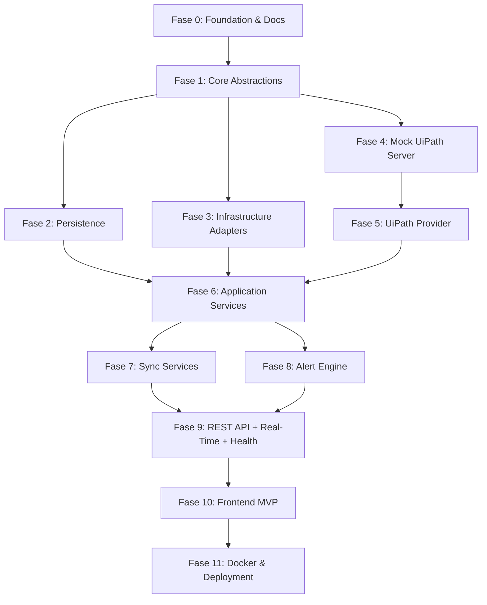

# Plan de Implementación - BotPulse (RPA Operations Platform)

## Introducción

Este plan describe la implementación incremental de **BotPulse**, la plataforma agnóstica de operaciones RPA descrita en `design.md` y `requirements.md`. La estrategia divide el trabajo en **12 fases** que entregan valor de forma progresiva:

1. Se construyen primero las bases (solución, documentación, ADRs, CI).
2. Se establecen las abstracciones del Core sin dependencias externas.
3. Se agregan las capas de persistencia e infraestructura sobre esas abstracciones.
4. Se levanta un **Mock UiPath Server** que emula el Orchestrator real, para desbloquear el desarrollo sin depender de credenciales productivas.
5. Se incorpora el primer proveedor RPA concreto (**UiPath**) implementando las interfaces granulares.
6. Se materializan los servicios de aplicación agnósticos del vendor.
7. Se orquesta la sincronización en background.
8. Se implementa el motor de alertas end-to-end.
9. Se expone la API REST versionada, notificaciones en tiempo real y health checks production-ready.
10. Se entrega un **Frontend MVP** en React + TypeScript consumiendo la API real, para dar visibilidad temprana del progreso.
11. Se empaqueta la plataforma para despliegue en Docker y otros modelos (incluyendo mock server y frontend en la stack).

## Nota sobre el orden de fases (revisado)

El plan original tenía UiPath Provider como Fase 4. Se ha reordenado por dos razones:

1. **Mock UiPath Server (Fase 4 nueva)**: Permite desarrollo y testing sin acceso a una instancia real de UiPath. Cuando se obtengan credenciales reales, solo se cambia `UIPATH_BASE_URL` para apuntar al Orchestrator productivo.
2. **Frontend MVP (Fase 10 nueva)**: Entrega valor visual antes de completar el 100% del backend, permitiendo iterar sobre UX temprano.

Docker (Fase 11) queda al final e incluye tanto el mock server como el frontend en la stack de compose.

## Convenciones

- **Numeración:** `Fase.Tarea.SubTarea` (ej. `1.2.3`).
- **Estado:** cada elemento es marcable con `- [ ]`.
- **Trazabilidad:** cada tarea principal referencia requisitos con `_Requirements: N, M, ..._`. `NFR` referencia requisitos no funcionales o restricciones arquitectónicas.
- **Tests:** las sub-tareas de test que son opcionales para MVP se identifican como tal en la descripción; los tests explícitamente exigidos por diseño no son opcionales.
- **Idioma:** documentación en español, código y comandos en inglés.

---

## Fase 0: Foundation & Documentation

- [x] 0.1 Crear la solución `.sln` y los 6 proyectos base
  - [x] 0.1.1 Ejecutar `dotnet new sln -n BotPulse` en la raíz del repositorio
  - [x] 0.1.2 Crear `src/BotPulse.Core` como `classlib` con `net8.0`, `Nullable=enable` e `ImplicitUsings=enable`
  - [x] 0.1.3 Crear `src/BotPulse.Shared` como `classlib` con `net8.0` (DTOs y constantes compartidas)
  - [x] 0.1.4 Crear `src/BotPulse.Infrastructure` como `classlib`, referenciando `BotPulse.Core`
  - [x] 0.1.5 Crear `src/BotPulse.Providers.UiPath` como `classlib`, referenciando `BotPulse.Core`
  - [x] 0.1.6 Crear `src/BotPulse.Api` como `webapi` (.NET 8, minimal hosting), referenciando Core, Infrastructure y Providers.UiPath
  - [x] 0.1.7 Crear `src/BotPulse.Worker` como `worker`, referenciando Core, Infrastructure y Providers.UiPath
  - [x] 0.1.8 Agregar los 6 proyectos al `.sln` con `dotnet sln add`
  - _Requirements: NFR (Clean Architecture, Restricción 1, 2, 4)_

- [ ] 0.2 Higiene del repositorio y gestión centralizada de dependencias
  - [x] 0.2.1 Añadir `.gitignore` estándar de .NET (bin/, obj/, .vs/, user secrets, logs/)
  - [x] 0.2.2 Añadir `.editorconfig` con reglas de estilo consistentes (indentación, `var`, `this.` prohibido, ordenamiento de using)
  - [x] 0.2.3 Crear `Directory.Packages.props` con `ManagePackageVersionsCentrally=true` y versiones pinned de todas las dependencias del stack
  - [x] 0.2.4 Habilitar `TreatWarningsAsErrors` en un `Directory.Build.props` compartido
  - [~] 0.2.5 Habilitar `GenerateDocumentationFile=true` en el mismo `Directory.Build.props`
  - _Requirements: NFR (Coding Standards)_

- [ ] 0.3 Documentación transversal del proyecto
  - [~] 0.3.1 Crear `docs/CodingStandards.md` alineado con la sección "Coding Standards Summary" del diseño
  - [~] 0.3.2 Crear `docs/Deployment.md` describiendo la matriz de despliegue (Docker Compose, Azure App Service, Azure Container Apps, IIS, Linux + Reverse Proxy)
  - [~] 0.3.3 Crear `docs/Security.md` cubriendo credencial management, network security, data validation y audit trail
  - [~] 0.3.4 Crear `docs/Roadmap.md` con las fases MVP → Fase 2 → Fase 3 → Fase 4 informativas
  - _Requirements: NFR (Deployment Flexibility, Seguridad, Extensibility)_

- [ ] 0.4 Architecture Decision Records (ADRs)
  - [~] 0.4.1 Crear `docs/ADR/README.md` con el índice de ADRs y la plantilla estándar (Status/Context/Decision/Alternatives/Consequences)
  - [~] 0.4.2 Redactar ADR-001 (Clean Architecture), ADR-002 (Provider Pattern Granular) y ADR-003 (Selective Persistence)
  - [~] 0.4.3 Redactar ADR-004 (Docker as Primary Packaging), ADR-005 (OAuth2 Client Credentials for UiPath) y ADR-006 (JWT as Session Token Only)
  - [~] 0.4.4 Redactar ADR-007 (PostgreSQL as Primary DB), ADR-008 (Independent Background Sync Services) y ADR-009 (Polling/SSE for MVP Real-Time)
  - [~] 0.4.5 Redactar ADR-010 (Repository + UoW), ADR-011 (Pluggable Authentication), ADR-012 (API Versioning from Day 1) y ADR-013 (Vendor-Agnostic RPA Operations Platform)
  - _Requirements: NFR (Restricciones Arquitectónicas 1-9)_

- [ ] 0.5 CI básico (build + test)
  - [~] 0.5.1 Añadir workflow `.github/workflows/ci.yml` (o equivalente) con setup de .NET 8, `dotnet restore`, `dotnet build --no-restore -c Release` y `dotnet test --no-build`
  - [~] 0.5.2 Añadir un badge de estado del build en `README.md`
  - _Requirements: NFR (Observability, Coding Standards)_

---

## Fase 1: Core Abstractions (Vendor-Agnostic)

- [ ] 1.1 Interfaces granulares de RPA Provider en `BotPulse.Core/Abstractions/Providers/`
  - [~] 1.1.1 Definir `IRobotProvider` con `GetRobotsAsync` y `GetRobotByIdAsync`
  - [~] 1.1.2 Definir `IJobProvider` con `GetJobsAsync(JobQuery)`, `GetJobByIdAsync`, `StartJobAsync`, `StopJobAsync`, `CancelJobAsync`
  - [~] 1.1.3 Definir `IQueueProvider` con `GetQueuesAsync` y `GetQueueItemsAsync(QueueItemQuery)`
  - [~] 1.1.4 Definir `ILogProvider` con `GetExecutionLogsAsync(LogQuery)`
  - [~] 1.1.5 Definir `IAssetProvider` con `GetAssetsAsync` (sin exponer valores secretos)
  - [~] 1.1.6 Definir `IMachineProvider` con `GetMachinesAsync` y `GetMachineByIdAsync`
  - [~] 1.1.7 Definir `IProcessProvider` con `GetProcessesAsync` y `GetProcessParametersAsync`
  - [~] 1.1.8 Definir `IProviderVersionNegotiator` con `NegotiateAsync` y el record `ProviderVersion`
  - _Requirements: 6, 7, 8, 9, 11, 13, 15, 19, NFR (Restricción 4)_

- [ ] 1.2 DTOs neutrales de Provider en `BotPulse.Core/Abstractions/Providers/Models/`
  - [~] 1.2.1 Definir records `RobotSnapshot`, `MachineSnapshot`, `ProcessSnapshot`, `ProcessParameter`
  - [~] 1.2.2 Definir records `JobSnapshot`, `StartJobRequest`, `StartJobResult`, `JobQuery`
  - [~] 1.2.3 Definir records `QueueSnapshot`, `QueueItemSnapshot`, `QueueItemQuery`
  - [~] 1.2.4 Definir records `ExecutionLogSnapshot`, `LogQuery`
  - [~] 1.2.5 Definir record `AssetMetadata` (sin campo de secret value)
  - _Requirements: 9, 11, 13, 15, 16, 20, 21, NFR (Restricción 1, 5)_

- [ ] 1.3 Abstracciones de autenticación y sesión
  - [~] 1.3.1 Definir `IAuthenticationProvider` con `AuthenticateAsync`, `IsHealthyAsync` y propiedad `ProviderName`
  - [~] 1.3.2 Definir records `AuthenticationRequest` y `AuthenticationResult`
  - [~] 1.3.3 Definir `ISessionTokenService` con `IssueToken` y `ValidateToken`
  - _Requirements: 1, 2, 3, NFR (Restricción 9)_

- [ ] 1.4 Abstracciones de notificaciones en tiempo real
  - [~] 1.4.1 Definir `INotificationDelivery` con `PublishAsync` y `SubscribeAsync` (IAsyncEnumerable)
  - [~] 1.4.2 Definir records `NotificationEvent` y `NotificationSubscription`
  - [~] 1.4.3 Definir `INotificationThrottler` con `ShouldDeliver`
  - _Requirements: 33, 34, NFR (Restricción 8)_

- [ ] 1.5 Abstracción de caché
  - [~] 1.5.1 Definir `ICacheService` con `GetAsync<T>`, `SetAsync<T>`, `RemoveAsync`, `InvalidatePatternAsync`
  - _Requirements: 9, 11, 13, 19, NFR (Escalabilidad, Restricción 7)_

- [ ] 1.6 Abstracciones del Alert Engine
  - [~] 1.6.1 Definir `IAlertChannel` con `Name`, `DeliverAsync`, `IsHealthyAsync`
  - [~] 1.6.2 Definir `IAlertRuleEvaluator` con `RuleType` y `EvaluateAsync`, más el record `AlertCandidate`
  - [~] 1.6.3 Definir `IAlertDeduplicator` con `ShouldEmit(rule, candidate, nowUtc)`
  - _Requirements: 28, 29, 30, NFR (Extensibility)_

- [ ] 1.7 Abstracciones de persistencia
  - [~] 1.7.1 Definir `IRepository<T>` con `GetByIdAsync`, `FindAsync(Expression)`, `AddAsync`, `Update`, `Remove`
  - [~] 1.7.2 Definir `IUnitOfWork` con `SaveChangesAsync` y `BeginTransactionAsync`
  - [~] 1.7.3 Definir `IAuditRepository` append-only con solo `RecordAsync` y consultas de lectura
  - _Requirements: 16, 18, 20, 21, 23, 42, NFR (Restricción 5)_

- [ ] 1.8 Abstracción de tiempo
  - [~] 1.8.1 Definir `ISystemClock` con `UtcNow` para permitir testing determinista
  - _Requirements: 28, 32, NFR (Testing)_

- [ ] 1.9 Entidades de dominio persistidas en `BotPulse.Core/Domain/Entities/`
  - [~] 1.9.1 Implementar `Job` con constructor privado y método factory `FromSnapshot` / `UpdateFromSnapshot`
  - [~] 1.9.2 Implementar `QueueItem` con enlace opcional a `OriginalItemId` (retries)
  - [~] 1.9.3 Implementar `ExecutionLog` con `PropertiesJson` como string estructurado
  - [~] 1.9.4 Implementar `MetricPoint` y `MetricRollup` con `DimensionsJson`
  - [~] 1.9.5 Implementar `AuditRecord` inmutable con factory `For(user, action, resource, outcome, ...)`
  - [~] 1.9.6 Implementar `User` (con `AuthProvider`, `Role`, `PasswordHash` opcional)
  - [~] 1.9.7 Implementar `Alert` y `AlertRule` con métodos factory `Raise` y `Configure`
  - [~] 1.9.8 Implementar `DashboardLayout` (relación 1:1 con `User`)
  - _Requirements: 16, 20, 21, 23, 25, 28, 31, 42_

- [ ] 1.10 Value Objects en `BotPulse.Core/Domain/ValueObjects/`
  - [~] 1.10.1 Definir enums fuertemente tipados `JobStatus`, `QueueItemStatus`, `LogSeverity`, `AlertSeverity`, `RollupGranularity`, `Role`
  - [~] 1.10.2 Escribir pruebas unitarias que validen paridad entre `enum` y strings usados en persistencia
  - _Requirements: 4, 16, 17, 20, 21, 23, 28_

- [ ] 1.11 Domain Events
  - [~] 1.11.1 Definir `JobStateChanged`, `AlertRaised`, `QueueItemProcessed`, `JobActionRequested`
  - [~] 1.11.2 Escribir pruebas unitarias que validen los invariantes de cada evento (campos obligatorios no nulos)
  - _Requirements: 18, 28, 34_

- [ ] 1.12 Jerarquía de excepciones del Core
  - [~] 1.12.1 Definir `BotPulseException` base y `ProviderException`, `AuthenticationException`, `AuthorizationException`
  - [~] 1.12.2 Definir `ValidationException` (con lista de errores por campo) y `EntityNotFoundException`
  - _Requirements: 3, 5, 7, 15, 39_

- [ ] 1.13 Cobertura de pruebas unitarias de dominio
  - [~] 1.13.1 Escribir tests unitarios para value objects, factory methods de entidades y domain events (proyecto `tests/BotPulse.UnitTests`)
  - [~] 1.13.2 Configurar xUnit + FluentAssertions + NSubstitute en el proyecto de tests
  - _Requirements: NFR (Testing Strategy)_

- [~] 1.14 Checkpoint - Compilación y tests unitarios verdes
  - Ensure all tests pass, ask the user if questions arise.

---

## Fase 2: Persistence Layer

- [ ] 2.1 `BotPulseDbContext` en `BotPulse.Infrastructure/Persistence/`
  - [~] 2.1.1 Crear `BotPulseDbContext` con `DbSet` solo para entidades persistidas (Users, Jobs, QueueItems, ExecutionLogs, MetricsRaw, MetricsHourly, MetricsDaily, Alerts, AlertRules, DashboardLayouts, AuditRecords)
  - [~] 2.1.2 Cargar configuraciones via `ApplyConfigurationsFromAssembly` y evitar `EnsureCreated`
  - _Requirements: 16, 20, 21, 23, 28, 31, 42, NFR (Restricción 5)_

- [ ] 2.2 Configuraciones EF Core (Fluent API)
  - [~] 2.2.1 Configurar `JobConfiguration` con clave única `(provider_name, external_job_id)` e índices en `status`, `start_time_utc`, `robot_external_id`, `process_external_id`
  - [~] 2.2.2 Configurar `QueueItemConfiguration` con clave única y self-reference para `OriginalItemId`
  - [~] 2.2.3 Configurar `ExecutionLogConfiguration` con índices en `timestamp_utc`, `severity` y `job_external_id`
  - [~] 2.2.4 Configurar `MetricPointConfiguration`, `MetricRollupConfiguration` (Hourly y Daily) con `DimensionsJson` mapeado a JSONB
  - [~] 2.2.5 Configurar `AlertConfiguration` y `AlertRuleConfiguration` con `ParametersJson` y `ChannelsJson` como JSONB
  - [~] 2.2.6 Configurar `UserConfiguration` con índice único en email y `(auth_provider, external_id)`
  - [~] 2.2.7 Configurar `AuditRecordConfiguration` con índices en `timestamp_utc`, `user_id`, `action` y `DashboardLayoutConfiguration` con `UNIQUE (user_id)`
  - _Requirements: 16, 20, 21, 23, 25, 28, 31, 42, NFR (Performance)_

- [ ] 2.3 Migración inicial
  - [~] 2.3.1 Configurar Npgsql como provider y añadir `AddDbContextPool<BotPulseDbContext>` con connection pooling
  - [~] 2.3.2 Generar migración `Initial` con `dotnet ef migrations add Initial --project src/BotPulse.Infrastructure --startup-project src/BotPulse.Api`
  - [~] 2.3.3 Verificar que la migración crea todas las tablas con nombres snake_case, JSONB donde aplique e índices definidos
  - _Requirements: 16, 20, 21, 23, 28, 31, 42, NFR (Performance)_

- [ ] 2.4 Repositorios especializados en `BotPulse.Infrastructure/Persistence/Repositories/`
  - [~] 2.4.1 Implementar `Repository<T>` genérico sobre `IRepository<T>`
  - [~] 2.4.2 Implementar `JobRepository` con `GetByExternalIdAsync`, `GetMaxUpdatedAtAsync`, `QueryAsync(JobFilter)` y `UpsertAsync(JobSnapshot)`
  - [~] 2.4.3 Implementar `QueueItemRepository` con soporte de upsert idempotente y consultas por `queue_name` y `status`
  - [~] 2.4.4 Implementar `LogRepository` con inserción por lotes configurable (batch size default 500)
  - [~] 2.4.5 Implementar `MetricsRepository` con `AddRawAsync`, `UpsertHourlyAsync`, `UpsertDailyAsync` y `QueryRangeAsync`
  - [~] 2.4.6 Implementar `AlertRepository` (`AddAsync`, `AcknowledgeAsync`, `GetUnacknowledgedCriticalAsync`) y `AlertRuleRepository` (CRUD, `GetEnabledAsync`)
  - [~] 2.4.7 Implementar `UserRepository` con `FindByUserNameAsync`, `FindByExternalIdAsync` y `DashboardLayoutRepository`
  - _Requirements: 16, 17, 20, 21, 23, 28, 29, 31, 42, NFR (Performance)_

- [ ] 2.5 Unit of Work y Audit Repository append-only
  - [~] 2.5.1 Implementar `UnitOfWork` sobre `BotPulseDbContext` con `SaveChangesAsync` y `BeginTransactionAsync`
  - [~] 2.5.2 Implementar `AuditRepository` que solo expone `RecordAsync` y consultas de lectura filtradas (sin Update/Delete)
  - _Requirements: 16, 18, 20, 42, NFR (Restricción 5)_

- [ ] 2.6 Registro en Dependency Injection
  - [~] 2.6.1 Crear `InfrastructureServiceCollectionExtensions.AddBotPulsePersistence(configuration)` que registre DbContext, todos los repositorios, `UnitOfWork` y `AuditRepository`
  - [~] 2.6.2 Aplicar validación de `IOptions<PostgreSqlOptions>` con `IValidateOptions<T>` (connection string obligatorio)
  - _Requirements: NFR (Deployment Flexibility, Fail Loud/Fail Early)_

- [ ] 2.7 Pruebas de integración con Testcontainers PostgreSQL
  - [~] 2.7.1 Configurar `PostgreSqlContainerFixture` (imagen `postgres:15-alpine`) con `WaitStrategy` a `pg_isready`
  - [~] 2.7.2 Escribir tests que apliquen migraciones y validen esquema (tablas, índices, unique constraints)
  - [~] 2.7.3 Escribir tests de repositorios: upsert idempotente de `Job`, batching de logs, ack de `Alert`, append-only de `AuditRecord`
  - [~] 2.7.4 Escribir property-based test: `upsert(snapshot) == upsert(upsert(snapshot))` para `JobRepository` (idempotencia)
  - _Requirements: 16, 20, 21, 42, NFR (Testing Strategy)_

- [~] 2.8 Checkpoint - Persistencia estable
  - Ensure all tests pass, ask the user if questions arise.

---

## Fase 3: Infrastructure Adapters

- [ ] 3.1 `MemoryCacheService` como `ICacheService`
  - [~] 3.1.1 Implementar `MemoryCacheService` con `IMemoryCache` + `ConcurrentDictionary<string, byte>` para poder invalidar por patrón
  - [~] 3.1.2 Escribir tests unitarios para get/set/remove y property-based test para invalidación por prefijo
  - _Requirements: 9, 11, 13, 19, NFR (Restricción 7)_

- [ ] 3.2 `JwtSessionTokenService` como `ISessionTokenService`
  - [~] 3.2.1 Implementar `JwtSessionTokenService` (HMAC SHA-256, claims `sub`, `name`, `email`, `auth_provider`, `role`)
  - [~] 3.2.2 Configurar `JwtOptions` con `IValidateOptions<JwtOptions>` (SigningKeyBase64, Issuer, Audience, ExpirationMinutes ∈ [15, 480])
  - [~] 3.2.3 Cargar `SigningKeyBase64` desde configuración/secret store; fallar arranque si está vacío o insuficiente
  - [~] 3.2.4 Escribir tests unitarios de emisión y validación, incluyendo property-based test `validate(issue(x)) == x` para todo `AuthenticationResult` válido
  - _Requirements: 3, NFR (Seguridad)_

- [ ] 3.3 `Argon2idPasswordHasher`
  - [~] 3.3.1 Implementar `Argon2idPasswordHasher : IPasswordHasher` con parámetros seguros (`t=3, m=64 MiB, p=1`) usando Konscious.Security.Cryptography
  - [~] 3.3.2 Escribir tests unitarios: hash es único por invocación, `Verify` acepta correctos y rechaza incorrectos, resistente a timing (uso de `FixedTimeEquals`)
  - _Requirements: 2, NFR (Seguridad)_

- [ ] 3.4 `LocalAuthenticationProvider`
  - [~] 3.4.1 Implementar `LocalAuthenticationProvider : IAuthenticationProvider` que consulta `IUserRepository` y verifica con `IPasswordHasher`
  - [~] 3.4.2 En caso de éxito, mapear el rol a `AuthenticationResult.Roles`; nunca revelar si falló el user o el password
  - [~] 3.4.3 En arranque, si el proveedor activo es `Local`, emitir warning "intended for development environments only"
  - [~] 3.4.4 Escribir tests unitarios cubriendo usuario inexistente, inactivo, provider distinto, password inválido y éxito
  - _Requirements: 1, 2_

- [ ] 3.5 Placeholders de proveedores externos
  - [~] 3.5.1 Crear `EntraIdAuthenticationProvider` con esqueleto y comentarios `// TODO Phase 2` para el flujo OpenID Connect
  - [~] 3.5.2 Crear `LdapAuthenticationProvider` con esqueleto e implementación mínima que lance `NotSupportedException`
  - [~] 3.5.3 Implementar `AddPluggableAuthentication` con switch por `Authentication:Provider` (`EntraID`, `LDAP`, `Local`) que falle si el valor es inválido
  - _Requirements: 1, 2, NFR (Restricción 9)_

- [ ] 3.6 Configuración de Serilog
  - [~] 3.6.1 Implementar `SerilogConfig.UseBotPulseSerilog(hostBuilder)` con sinks Console y File (rolling diario, retención 30 días)
  - [~] 3.6.2 Enriquecer con `MachineName`, `EnvironmentName`, `Application=BotPulse` y propiedad `CorrelationId`
  - [~] 3.6.3 Configurar `LogEventLevel` por namespace desde `appsettings.json`
  - _Requirements: 41, NFR (Observability)_

- [ ] 3.7 Middlewares de la API
  - [~] 3.7.1 Implementar `CorrelationIdMiddleware` que lea o genere `X-Correlation-Id` y lo agregue a `LogContext`
  - [~] 3.7.2 Implementar `RequestLoggingMiddleware` que logee método, path, status y duración
  - [~] 3.7.3 Implementar `ErrorHandlerMiddleware` que mapee excepciones del Core a `errorCode`/HTTP status y respuesta JSON estándar (`errorCode`, `message`, `correlationId`, `timestamp`, `details[]`)
  - [~] 3.7.4 Implementar `AuditMiddleware` que persista audit records para acciones sensibles (login, logout, job actions, alert rule changes, asset access, config changes)
  - _Requirements: 4, 5, 39, 41, 42_

- [ ] 3.8 Registro DI de infraestructura
  - [~] 3.8.1 Ampliar `InfrastructureServiceCollectionExtensions` con `AddBotPulseInfrastructure(configuration)` que registre cache, hasher, session token, pluggable auth y logging
  - _Requirements: NFR (Restricción 6, 7, 8, 9)_

- [ ] 3.9 Cobertura de tests unitarios de infraestructura
  - [~] 3.9.1 Cubrir middlewares con tests basados en `RequestDelegate` mockeado + `DefaultHttpContext`
  - [~] 3.9.2 Cubrir el mapeo de excepciones del `ErrorHandlerMiddleware` a todos los `errorCode` definidos en diseño
  - _Requirements: 39, NFR (Testing Strategy)_

- [~] 3.10 Checkpoint - Infraestructura lista para consumo
  - Ensure all tests pass, ask the user if questions arise.

---

## Fase 4: Mock UiPath Server

Fase nueva. Un proyecto ASP.NET Core Web API separado (`BotPulse.MockUiPath`) que emula los endpoints reales de UiPath Orchestrator con datos ficticios en memoria. El objetivo es permitir desarrollar y testear **todo el sistema** sin necesidad de una instancia real de UiPath. Cuando se obtengan credenciales productivas, solo se cambia `UIPATH_BASE_URL` para apuntar al Orchestrator real; ningún componente de BotPulse cambia.

- [ ] 4.1 Crear proyecto `BotPulse.MockUiPath` (ASP.NET Core webapi, .NET 8)
  - [~] 4.1.1 Ejecutar `dotnet new webapi -n BotPulse.MockUiPath -o mocks/BotPulse.MockUiPath -f net8.0 --use-minimal-apis`
  - [~] 4.1.2 Agregar el proyecto al `.sln` con `dotnet sln add mocks/BotPulse.MockUiPath/BotPulse.MockUiPath.csproj`
  - [~] 4.1.3 Configurar puerto `5100` en `launchSettings.json` y `applicationUrl`
  - _Requirements: 7, NFR (Testing Strategy, Deployment Flexibility)_

- [ ] 4.2 Emulación de OAuth2 (endpoint `/identity_/connect/token`)
  - [~] 4.2.1 Implementar `POST /identity_/connect/token` que acepte `client_id`/`client_secret` (form-urlencoded o JSON) y devuelva `{ access_token, expires_in: 3600, token_type: "Bearer" }`
  - [~] 4.2.2 Aceptar cualquier `ClientId`/`ClientSecret` configurable en `appsettings.json` (para poder simular credenciales de testing)
  - _Requirements: 7, NFR (Testing Strategy)_

- [ ] 4.3 Datos ficticios en memoria (`MockDataStore`)
  - [~] 4.3.1 Crear `MockDataStore` (singleton) con seed data: 10 robots (varios estados), 5 machines, 8 processes, 3 queues, 200 jobs (últimos 30 días con estados variados), 500 queue items, 1000 execution logs, 20 assets
  - [~] 4.3.2 Datos deterministas para snapshots pero con IDs únicos por seed (usar `Random(seed)` para reproducibilidad)
  - [~] 4.3.3 Timestamps calculados dinámicamente a partir de `DateTime.UtcNow` para simular tiempo real (`LastHeartbeat`, `StartTime`, `EndTime` relativos)
  - _Requirements: 7, 9, 11, 13, 16, 20, 21_

- [ ] 4.4 Endpoints OData de UiPath - Robots
  - [~] 4.4.1 Implementar `GET /odata/Robots` con paginación OData (`$top`, `$skip`, `$filter`, `$orderby`)
  - [~] 4.4.2 Implementar `GET /odata/Robots({id})` para robot individual, devolviendo 404 si no existe
  - _Requirements: 7, 9, 10_

- [ ] 4.5 Endpoints OData - Jobs
  - [~] 4.5.1 Implementar `GET /odata/Jobs` con filtros por `status`, `robot`, `process`, `dateRange`
  - [~] 4.5.2 Implementar `GET /odata/Jobs({id})`
  - [~] 4.5.3 Implementar `POST /odata/Jobs/UiPath.Server.Configuration.OData.StartJobs` (start job simulado; crea job en estado `Pending`)
  - [~] 4.5.4 Implementar `POST /odata/Jobs({id})/UiPath.Server.Configuration.OData.StopJob`
  - [~] 4.5.5 Implementar background task que simule transición de estados `Pending → Running → Success/Failed` cada N segundos (configurable)
  - _Requirements: 7, 16, 17, 18_

- [ ] 4.6 Endpoints OData - Queues, QueueItems
  - [~] 4.6.1 Implementar `GET /odata/QueueDefinitions`
  - [~] 4.6.2 Implementar `GET /odata/QueueItems` con filtros por `queueName`, `status`, `updatedSince`
  - [~] 4.6.3 Simular processing de items: `New → InProgress → Success/Failed` con timers de fondo
  - _Requirements: 7, 19, 20_

- [ ] 4.7 Endpoints OData - Machines, Processes, Assets
  - [~] 4.7.1 Implementar `GET /odata/Machines`
  - [~] 4.7.2 Implementar `GET /odata/Releases` (processes/releases de UiPath)
  - [~] 4.7.3 Implementar `GET /odata/Assets` sin exponer nunca el valor secreto en la respuesta (`Value` siempre `null` o placeholder)
  - _Requirements: 7, 11, 13, 15_

- [ ] 4.8 Endpoints OData - RobotLogs
  - [~] 4.8.1 Implementar `GET /odata/RobotLogs` con filtros por `jobKey`, `severity`, `timeStamp`
  - [~] 4.8.2 Generar logs dinámicos vinculados a jobs existentes (a medida que un job transiciona, se generan sus logs)
  - _Requirements: 7, 21_

- [ ] 4.9 Health check y documentación del mock
  - [~] 4.9.1 Implementar endpoint `/health` que devuelva `200 OK` con `{ status: "Healthy", server: "MockUiPath", uptime: "..." }`
  - [~] 4.9.2 Habilitar Swagger UI en `/swagger` para explorar los endpoints simulados
  - [~] 4.9.3 Crear `mocks/BotPulse.MockUiPath/README.md` explicando cómo levantarlo (`dotnet run`), qué endpoints emula y cómo configurar credenciales de prueba
  - _Requirements: 7, NFR (Testing Strategy, Observability)_

- [ ] 4.10 Docker support del mock
  - [~] 4.10.1 Crear `deploy/Dockerfile.MockUiPath` multi-stage (SDK build+publish, runtime `mcr.microsoft.com/dotnet/aspnet:8.0-alpine`, usuario no-root, `EXPOSE 5100`)
  - [~] 4.10.2 Preparar el binding para integración con docker-compose (servicio se agrega en Fase 11 en la stack completa)
  - _Requirements: 7, NFR (Deployment Flexibility)_

- [~] 4.11 Checkpoint - Mock UiPath operativo
  - Ensure all tests pass, ask the user if questions arise.
  - Verificar manualmente con `curl` o Postman que `POST /identity_/connect/token` y `GET /odata/Robots` responden con datos ficticios.

---

## Fase 5: UiPath Provider (Primer proveedor RPA)

- [ ] 5.1 Opciones y validación
  - [~] 5.1.1 Definir `UiPathOptions` (BaseUrl, Tenant, ClientId, ClientSecret, TimeoutSeconds default 30, TokenSkewSeconds)
  - [~] 5.1.2 Implementar `UiPathOptionsValidator : IValidateOptions<UiPathOptions>` (BaseUrl válido, ClientId/Secret no vacíos, Timeout ∈ [5, 300])
  - _Requirements: 7, NFR (Fail Loud/Fail Early, Seguridad)_

- [ ] 5.2 `UiPathHttpClient` con Polly
  - [~] 5.2.1 Registrar `HttpClient` tipado con `AddHttpClient<UiPathHttpClient>` y timeout configurable
  - [~] 5.2.2 Añadir handler Polly `WaitAndRetryAsync` (jittered exponential backoff, 3 intentos por defecto) + `TimeoutPolicy`
  - [~] 5.2.3 Implementar métodos `GetOdataAsync<T>`, `PostAsync<TReq, TRes>`, `PostAsync(TReq)` reutilizables
  - _Requirements: 7, NFR (Seguridad, Observability)_

- [ ] 5.3 `UiPathOAuth2TokenManager`
  - [~] 5.3.1 Implementar client credentials contra `{BaseUrl}/identity_/connect/token` con `client_id`/`client_secret`
  - [~] 5.3.2 Cachear token en memoria y refrescar antes de `expires_in - skew`
  - [~] 5.3.3 Ante fallo de refresh, intentar re-autenticación completa y logear; ante fallo final, marcar unhealthy para `/health/ready`
  - [~] 5.3.4 Escribir tests unitarios con `HttpMessageHandler` fake cubriendo éxito, expiración, refresh y fallo terminal
  - _Requirements: 7_

- [ ] 5.4 `UiPathVersionNegotiator`
  - [~] 5.4.1 Implementar `IProviderVersionNegotiator` que consulte la versión del Orchestrator y devuelva `ProviderVersion(ProviderName="UiPath", VendorVersion, SupportedImplementation="V1")`
  - [~] 5.4.2 Si el vendor devuelve versión no mapeable, retornar `SupportedImplementation=null` para que el arranque falle con mensaje descriptivo
  - _Requirements: 8_

- [ ] 5.5 `UiPathProviderFactory` con selección por versión
  - [~] 5.5.1 Implementar `UiPathProviderFactory` que negocie una vez al arranque y devuelva instancias V1 (con hueco para V2)
  - [~] 5.5.2 Bloquear el cambio dinámico de versión durante la vida de la sesión
  - _Requirements: 8_

- [ ] 5.6 `UiPathV1RobotProvider`
  - [~] 5.6.1 Implementar `GetRobotsAsync` (OData `/odata/Robots`) y `GetRobotByIdAsync`
  - [~] 5.6.2 Mapear DTO privado a `RobotSnapshot` con status normalizado ("Online" / "Offline" / "Idle" / "Busy")
  - _Requirements: 7, 9, 10_

- [ ] 5.7 `UiPathV1JobProvider`
  - [~] 5.7.1 Implementar `GetJobsAsync(JobQuery)` traduciendo el query a filtros OData (`$filter`, `$top`, `$orderby`)
  - [~] 5.7.2 Implementar `GetJobByIdAsync`
  - [~] 5.7.3 Implementar `StartJobAsync` (endpoint `Jobs/UiPath.Server.Configuration.OData.StartJobs`) y `StopJobAsync`, `CancelJobAsync`
  - [~] 5.7.4 Mapear estados nativos de UiPath a `JobStatus` neutral (Pending/Running/Success/Failed/Stopped/Cancelled)
  - _Requirements: 7, 16, 17, 18_

- [ ] 5.8 `UiPathV1QueueProvider`
  - [~] 5.8.1 Implementar `GetQueuesAsync` (endpoint `QueueDefinitions`)
  - [~] 5.8.2 Implementar `GetQueueItemsAsync(QueueItemQuery)` con filtros por queue y ventana de actualización
  - _Requirements: 7, 19, 20_

- [ ] 5.9 `UiPathV1LogProvider`
  - [~] 5.9.1 Implementar `GetExecutionLogsAsync(LogQuery)` (endpoint `RobotLogs`) mapeando severidad y properties estructuradas
  - _Requirements: 7, 21_

- [ ] 5.10 `UiPathV1AssetProvider`
  - [~] 5.10.1 Implementar `GetAssetsAsync` mapeando a `AssetMetadata` **sin** exponer el valor secreto
  - [~] 5.10.2 Test unitario que verifica que el DTO neutral nunca expone campos de valor
  - _Requirements: 7, 15_

- [ ] 5.11 `UiPathV1MachineProvider`
  - [~] 5.11.1 Implementar `GetMachinesAsync` y `GetMachineByIdAsync` mapeando a `MachineSnapshot`
  - _Requirements: 7, 11, 12_

- [ ] 5.12 `UiPathV1ProcessProvider`
  - [~] 5.12.1 Implementar `GetProcessesAsync` (endpoint `Releases`)
  - [~] 5.12.2 Implementar `GetProcessParametersAsync(processExternalId)` mapeando a `ProcessParameter`
  - _Requirements: 7, 13, 14_

- [ ] 5.13 `UiPathErrorTranslator`
  - [~] 5.13.1 Traducir errores HTTP y payloads de UiPath a `ProviderException`, `EntityNotFoundException` y `AuthenticationException` del Core
  - [~] 5.13.2 Preservar el correlation id en el `Data` de la excepción para diagnóstico
  - _Requirements: 7, 15, 39_

- [ ] 5.14 Estructura preparada para V2
  - [~] 5.14.1 Crear carpeta `V2/` con archivos vacíos (`.gitkeep`) y notas de "reserved for UiPath v2"
  - _Requirements: 8_

- [ ] 5.15 Registro DI del proveedor UiPath
  - [~] 5.15.1 Implementar `UiPathProviderRegistration.AddUiPathProvider(configuration)` que registre options, HttpClient, token manager, factory, negotiator y las 7 interfaces granulares
  - [~] 5.15.2 Documentar en `docs/Deployment.md` las variables `UIPATH_BASE_URL`, `UIPATH_TENANT`, `UIPATH_CLIENT_ID`, `UIPATH_CLIENT_SECRET`
  - _Requirements: 7, NFR (Restricción 6)_

- [ ] 5.16 Pruebas de integración con WireMock.Net
  - [~] 5.16.1 Levantar `WireMockServer` con stubs para `/identity_/connect/token`, `/odata/Robots`, `/odata/Jobs`, `/odata/QueueItems`, `/odata/RobotLogs`, `/odata/Machines`, `/odata/Releases`, `/odata/Assets`
  - [~] 5.16.2 Test de token refresh (respuesta con `expires_in` corto)
  - [~] 5.16.3 Test de retry Polly (WireMock devuelve 5xx dos veces y luego éxito)
  - [~] 5.16.4 Test de mapeo end-to-end de `JobSnapshot` (estados, timestamps UTC, duración)
  - [~] 5.16.5 Test de `UiPathErrorTranslator` traduciendo 401, 404, 500 y `Fault` payloads
  - [~] 5.16.6 Test de integración corriendo contra el **Mock UiPath Server real** (`docker-compose up mock-uipath` o `dotnet run` local), verificando el flujo completo: token → GET Robots → GET Jobs → StartJob → mapping a `JobSnapshot`
  - _Requirements: 7, 8, NFR (Testing Strategy)_

- [~] 5.17 Checkpoint - UiPath Provider integrado
  - Ensure all tests pass, ask the user if questions arise.

---

## Fase 6: Application Services (Vendor-Agnostic)

- [ ] 6.1 Servicios de lectura on-demand
  - [~] 6.1.1 Implementar `RobotQueryService` con caché opcional vía `ICacheService` (TTL configurable, default 120s, `forceRefresh` para bypass)
  - [~] 6.1.2 Implementar `MachineQueryService` (default TTL 300s) y `ProcessQueryService` (default TTL 600s)
  - [~] 6.1.3 Implementar `AssetQueryService` invocando `IAssetProvider` + audit vía `IAuditRepository` (nunca cachea, nunca expone secrets)
  - _Requirements: 9, 10, 11, 12, 13, 14, 15_

- [ ] 6.2 Servicios de Jobs
  - [~] 6.2.1 Implementar `JobQueryService` sobre `IJobRepository` (filtros por rango de fechas, robot, process, machine, status, error type; paginación 50; sort dinámico)
  - [~] 6.2.2 Implementar `JobCommandService.StartAsync` con audit + emisión de `JobActionRequested` a `INotificationDelivery`
  - [~] 6.2.3 Implementar `StopAsync`, `CancelAsync` y `RetryAsync` (linkando el nuevo job con `RetryOfJobId`)
  - [~] 6.2.4 Escribir tests unitarios con `IJobProvider` mockeado cubriendo éxito, error del provider (audit outcome=Error) y notificación emitida
  - _Requirements: 17, 18_

- [ ] 6.3 Servicios de Queues
  - [~] 6.3.1 Implementar `QueueQueryService` con metadata on-demand vía `IQueueProvider` y caché opcional (default TTL 180s)
  - [~] 6.3.2 Implementar `QueueAnalyticsService` sobre `IQueueItemRepository` (pending, processed, failed, avg processing time)
  - _Requirements: 19, 20_

- [ ] 6.4 Servicio de consulta de logs
  - [~] 6.4.1 Implementar `LogQueryService` con filtros por severidad, rango, jobId, robot, process y búsqueda por keyword; paginación por default
  - _Requirements: 21, 22_

- [ ] 6.5 Servicios de métricas
  - [~] 6.5.1 Implementar `MetricsQueryService` con selección automática de granularidad (raw / hourly / daily) según rango solicitado
  - [~] 6.5.2 Implementar `MetricsAggregationService` con rollup hourly y daily; property-based test `sum(hourlyBuckets) == sum(rawPoints)` para toda serie temporal generada
  - _Requirements: 23, 24_

- [ ] 6.6 Servicios de dashboard
  - [~] 6.6.1 Implementar `DashboardConfigurationService` (get, put, resetToDefault por usuario)
  - [~] 6.6.2 Implementar `DashboardInitializer` con layouts default por rol (Viewer, Operator, Administrator)
  - [~] 6.6.3 Implementar `WidgetPermissionModel` y filtrado del catálogo de widgets por rol
  - _Requirements: 25, 26, 27_

- [ ] 6.7 Orquestador de autenticación
  - [~] 6.7.1 Implementar `AuthenticationOrchestrator.LoginAsync(request)` que llame a `IAuthenticationProvider`, sincronice `User` en repo (upsert de externalId, roles) y emita JWT con `ISessionTokenService`
  - [~] 6.7.2 Registrar audit `Login` (Success/Failure) y `Logout`; emitir warning si `Local` provider activo
  - _Requirements: 1, 2, 3, 4, 42_

- [ ] 6.8 Cobertura de pruebas unitarias de application services
  - [~] 6.8.1 Escribir tests exhaustivos con mocks de proveedores y repositorios, cubriendo happy path, cache hit/miss, force refresh y errores
  - [~] 6.8.2 Property-based test para el throttler de resultados de `RobotQueryService` con caché (get after set → same value)
  - _Requirements: NFR (Testing Strategy)_

- [~] 6.9 Checkpoint - Servicios de aplicación operativos
  - Ensure all tests pass, ask the user if questions arise.

---

## Fase 7: Background Sync Services

- [ ] 7.1 Contrato y base común
  - [~] 7.1.1 Definir `ISynchronizationService` (`Name`, `Options`, `CurrentStatus`, `StartAsync`, `StopAsync`, `RunOnceAsync`, `IsHealthyAsync`) y records `SynchronizationOptions`, `SynchronizationServiceStatus`
  - [~] 7.1.2 Implementar `SynchronizationServiceBase` con bucle `PeriodicTimer`, `SemaphoreSlim(1,1)` (single-flight por servicio) y `IServiceScopeFactory` para scopes limpios
  - [~] 7.1.3 Aplicar clamp de intervalo mínimo (30s) con warning log
  - _Requirements: 35, 36, 37_

- [ ] 7.2 `SynchronizationOrchestrator` (IHostedService)
  - [~] 7.2.1 Implementar `StartAsync` que arranque los servicios habilitados por configuración; deshabilitados no se schedulean
  - [~] 7.2.2 Implementar `GetStatuses()` y `TriggerAsync(serviceName, user)` (audit del trigger manual)
  - [~] 7.2.3 Asegurar fault isolation: excepciones en un servicio no detienen a los demás
  - _Requirements: 35, 36_

- [ ] 7.3 `JobSynchronizationService`
  - [~] 7.3.1 Implementar `RunOnceAsync`: leer `MaxUpdatedAt`, invocar `IJobProvider.GetJobsAsync(since)`, upsert idempotente, `SaveChangesAsync`
  - [~] 7.3.2 No actualizar jobs ya en estado terminal
  - [~] 7.3.3 Default interval 120s, configurable
  - _Requirements: 16, 18, 35, 37_

- [ ] 7.4 `QueueItemSynchronizationService`
  - [~] 7.4.1 Implementar `RunOnceAsync` con upsert y linkeo `OriginalItemId` para retries
  - [~] 7.4.2 Default interval 180s
  - _Requirements: 20, 35, 37_

- [ ] 7.5 `LogSynchronizationService`
  - [~] 7.5.1 Implementar `RunOnceAsync` con inserción por lotes (batch size default 500)
  - [~] 7.5.2 Default interval 60s
  - _Requirements: 21, 35, 37_

- [ ] 7.6 `MetricsCollectionService`
  - [~] 7.6.1 Calcular métricas por intervalo (jobs total/success/failed/cancelled, avg duration, success rate, queue backlog, robot/machine availability) desde repositorios locales
  - [~] 7.6.2 Persistir `MetricPoint` y actualizar `MetricRollup` hourly/daily incrementalmente
  - [~] 7.6.3 Default interval 300s
  - _Requirements: 23, 35, 37_

- [ ] 7.7 Configuración granular con `IOptionsMonitor`
  - [~] 7.7.1 Definir `SynchronizationOptions` por servicio y bind desde `Synchronization:{JobSync|QueueItemSync|LogSync|MetricsCollection}`
  - [~] 7.7.2 Cada servicio observa `IOptionsMonitor` y actualiza intervalo en el próximo ciclo sin reinicio
  - _Requirements: 35, 36, 37_

- [ ] 7.8 Trigger manual y estado por API
  - [~] 7.8.1 Habilitar hook para que el `AdminController` invoque `SynchronizationOrchestrator.TriggerAsync` con audit
  - [~] 7.8.2 Exponer `GetStatuses()` para `/health/ready` y el `AdminController`
  - _Requirements: 36, 40_

- [ ] 7.9 Registro DI del Worker
  - [~] 7.9.1 Registrar los 4 sync services + orchestrator + health check individual
  - [~] 7.9.2 Compartir mismos servicios de infraestructura y Providers.UiPath que la API
  - _Requirements: 35, NFR (Escalabilidad)_

- [ ] 7.10 Tests de integración de sincronización
  - [~] 7.10.1 Reemplazar `IJobProvider` por un fake determinista y verificar upsert idempotente sobre Postgres (Testcontainers)
  - [~] 7.10.2 Verificar que un error inyectado en un servicio no afecta a los demás
  - [~] 7.10.3 Verificar que cambiar `IntervalSeconds` en tiempo de ejecución (mediante `IOptionsMonitor` sourced from IConfiguration) actualiza la cadencia
  - _Requirements: 35, 36, 37, NFR (Testing Strategy)_

- [~] 7.11 Checkpoint - Sync services estables
  - Ensure all tests pass, ask the user if questions arise.

---

## Fase 8: Alert Engine

- [ ] 8.1 CRUD de reglas de alerta
  - [~] 8.1.1 Implementar `AlertRuleService` (Create, Read, Update, Delete, Enable/Disable) sobre `IAlertRuleRepository`
  - [~] 8.1.2 Validar `ParametersJson` según `RuleType` con validadores dedicados
  - [~] 8.1.3 Auditar toda modificación de reglas
  - _Requirements: 28, 29_

- [ ] 8.2 Evaluadores de reglas
  - [~] 8.2.1 Implementar `RobotOfflineEvaluator` (usa `IRobotProvider`, umbral default 10 min, severity Critical)
  - [~] 8.2.2 Implementar `QueueBacklogEvaluator` sobre `IQueueItemRepository` con umbrales de Warning y Critical
  - [~] 8.2.3 Implementar `JobsFailedInWindowEvaluator` sobre `IJobRepository` (ventana temporal configurable)
  - [~] 8.2.4 Implementar `MachineOfflineEvaluator` (usa `IMachineProvider`, umbral default 60 min)
  - [~] 8.2.5 Implementar `ProcessExecutionTimeEvaluator` comparando `Duration` con expectativa por proceso
  - _Requirements: 29_

- [ ] 8.3 Deduplicación de alertas
  - [~] 8.3.1 Implementar `AlertDeduplicator : IAlertDeduplicator` con ventana configurable (default 5 min) por `(rule, resource)`
  - [~] 8.3.2 Property-based test: para cualquier secuencia de candidatos dentro de la ventana, el número de alertas emitidas por `(rule, resource)` no supera 1
  - _Requirements: 28_

- [ ] 8.4 Orquestación del engine
  - [~] 8.4.1 Implementar `AlertEngine.EvaluateAllAsync` que itere reglas activas, invoque el evaluador correspondiente, filtre por dedup, persista y despache
  - [~] 8.4.2 Emitir domain event `AlertRaised` a `INotificationDelivery`
  - [~] 8.4.3 Audit del evento de generación
  - _Requirements: 28_

- [ ] 8.5 Notification Router con retries Polly
  - [~] 8.5.1 Implementar `NotificationRouter.DispatchAsync` que resuelva canales por regla y despache en paralelo
  - [~] 8.5.2 Aplicar retry Polly exponential backoff, default 3 intentos por canal
  - [~] 8.5.3 Marcar canal degradado tras fallo total y reflejar en health check de alerts
  - [~] 8.5.4 Property-based test: la suma de esperas del backoff está acotada superiormente por el máximo teórico
  - _Requirements: 30_

- [ ] 8.6 Canales de alerta (5)
  - [~] 8.6.1 Implementar `LogAlertChannel` (siempre habilitado, escribe con Serilog en nivel según severidad)
  - [~] 8.6.2 Implementar `EmailAlertChannel` (SMTP con `MailKit`, opciones validadas al arranque)
  - [~] 8.6.3 Implementar `SlackAlertChannel` (webhook payload JSON con severidad y recurso afectado)
  - [~] 8.6.4 Implementar `TeamsAlertChannel` (webhook MessageCard)
  - [~] 8.6.5 Implementar `WebhookAlertChannel` (POST genérico con firma HMAC opcional)
  - _Requirements: 30, NFR (Extensibility)_

- [ ] 8.7 Motor de escalación
  - [~] 8.7.1 Implementar `EscalationEngine.EscalatePendingAsync` que revise alertas Critical no reconocidas y aplique timeouts (default 15 min primer nivel, 30 min segundo)
  - [~] 8.7.2 Incrementar `EscalationLevel` y despachar a canales de escalación
  - _Requirements: 32_

- [ ] 8.8 Acknowledgment de alertas
  - [~] 8.8.1 Implementar `AlertAcknowledgmentService.AcknowledgeAsync(alertId, user)` con audit
  - [~] 8.8.2 Al ack, el `NotificationRouter` deja de despachar re-notificaciones para esa alerta
  - _Requirements: 31, 32_

- [ ] 8.9 Hosted service de evaluación
  - [~] 8.9.1 Implementar `AlertEvaluationService : ISynchronizationService` (interval default 60s) que invoque `AlertEngine.EvaluateAllAsync` y `EscalationEngine.EscalatePendingAsync`
  - [~] 8.9.2 Registrarlo en el `SynchronizationOrchestrator`
  - _Requirements: 28, 32, 35_

- [ ] 8.10 Retención de alertas
  - [~] 8.10.1 Implementar job de retención con default 12 meses y purga configurable
  - _Requirements: 31_

- [ ] 8.11 Cobertura de pruebas
  - [~] 8.11.1 Tests unitarios por evaluador (thresholds, ventanas, severidad correcta)
  - [~] 8.11.2 Tests del `NotificationRouter` con canales que fallan intermitentemente
  - [~] 8.11.3 Property-based tests: dedup + retry backoff (indicados arriba)
  - _Requirements: 28, 29, 30, NFR (Testing Strategy)_

- [~] 8.12 Checkpoint - Alert Engine end-to-end
  - Ensure all tests pass, ask the user if questions arise.

---

## Fase 9: REST API v1 + Real-Time + Health Checks

- [ ] 9.1 API Versioning y OpenAPI
  - [~] 9.1.1 Registrar `Microsoft.AspNetCore.Mvc.Versioning` con default `v1.0`, `AssumeDefaultVersionWhenUnspecified=false`, lectores `UrlSegment` + `Header (api-version)`
  - [~] 9.1.2 Registrar `AddVersionedApiExplorer` con `GroupNameFormat="'v'VVV"` y `SubstituteApiVersionInUrl=true`
  - [~] 9.1.3 Configurar Swagger/OpenAPI con un documento por versión (`/swagger/v1/swagger.json`) e integración de Bearer Auth
  - _Requirements: 38, 39_

- [ ] 9.2 Controllers V1 (parte 1)
  - [~] 9.2.1 Implementar `RobotsController`, `MachinesController`, `ProcessesController`, `AssetsController` (`[Authorize(Policy="ViewAssets")]`)
  - [~] 9.2.2 Implementar `JobsController` con endpoints de query, start, stop, cancel, retry (policies `JobActions`)
  - [~] 9.2.3 Implementar `QueuesController` y `LogsController`
  - _Requirements: 4, 5, 9, 10, 11, 12, 13, 14, 15, 17, 18, 19, 20, 21, 22_

- [ ] 9.3 Controllers V1 (parte 2)
  - [~] 9.3.1 Implementar `MetricsController`, `AlertsController` (list, ack), `AlertRulesController` (`ManageAlertRules`)
  - [~] 9.3.2 Implementar `DashboardController` (GET/PUT layout, reset default)
  - [~] 9.3.3 Implementar `AuthController` (`/auth/login`, `/auth/logout`, `/auth/me`) y `AdminController` (`/admin/sync/{service}/trigger`, `/admin/sync/status`)
  - [~] 9.3.4 Implementar `NotificationsController` con endpoints `/notifications/stream` (SSE) y `/notifications/pull` (polling con `since`)
  - _Requirements: 3, 4, 5, 23, 24, 25, 26, 27, 28, 29, 31, 33, 34, 36_

- [ ] 9.4 Validación con FluentValidation
  - [~] 9.4.1 Registrar `FluentValidation.AspNetCore` y crear validadores para DTOs de entrada (login, start job, alert rule create/update, dashboard layout)
  - [~] 9.4.2 Mapear errores a `errorCode="VALIDATION_ERROR"` con detalles por campo (HTTP 400)
  - _Requirements: 39_

- [ ] 9.5 Entrega de notificaciones en tiempo real
  - [~] 9.5.1 Implementar `SseNotificationDelivery` con `Channel<NotificationEvent>` por subscriber y heartbeat `retry:` para reconexión del cliente
  - [~] 9.5.2 Implementar `PollingNotificationDelivery` con buffer en memoria TTL y query por `since`
  - [~] 9.5.3 Implementar `TokenBucketNotificationThrottler` (máx 1 entrega/s por `(resourceType, resourceId)`) y test unitario de coalescing
  - [~] 9.5.4 Registrar `AddPluggableNotifications(configuration)` con switch por `Notifications:Transport` (SSE|Polling)
  - _Requirements: 33, 34, NFR (Restricción 8)_

- [ ] 9.6 SignalR skeleton (preparación fase 3)
  - [~] 9.6.1 Crear `SignalRNotificationDelivery` con métodos con `throw new NotImplementedException` y comentario `// TODO Phase 3`
  - [~] 9.6.2 Añadir clase `SseHub` en `BotPulse.Api/Notifications/` como punto de extensión documentado
  - _Requirements: 33, NFR (Extensibility)_

- [ ] 9.7 Health Checks
  - [~] 9.7.1 Implementar `DatabaseHealthCheck` (ping a `SELECT 1`) con tag `ready`
  - [~] 9.7.2 Implementar `RpaProviderHealthCheck` que consulte token válido del provider activo (tag `ready`)
  - [~] 9.7.3 Implementar `SynchronizationHealthCheck` consultando `SynchronizationOrchestrator.GetStatuses()`
  - [~] 9.7.4 Implementar `CacheHealthCheck` con probe put/get/remove
  - [~] 9.7.5 Mapear endpoints `/health` (agregado JSON), `/health/live` (liveness) y `/health/ready` (readiness sólo con tag `ready`)
  - _Requirements: 40, NFR (Observability)_

- [ ] 9.8 Authorization policies
  - [~] 9.8.1 Registrar policies `RequireOperator`, `RequireAdministrator`, `ViewAssets`, `ManageAlertRules`, `JobActions`
  - [~] 9.8.2 Aplicar `[Authorize(Policy=...)]` en todos los endpoints sensibles
  - _Requirements: 4, 5, 15_

- [ ] 9.9 Seguridad de transporte
  - [~] 9.9.1 Habilitar `UseHttpsRedirection` + `UseHsts` (excepto Development)
  - [~] 9.9.2 Configurar CORS restrictivo tomando orígenes desde `Cors:AllowedOrigins`
  - [~] 9.9.3 Documentar en `docs/Security.md` la política y ejemplos
  - _Requirements: NFR (Seguridad)_

- [ ] 9.10 Composición `Program.cs`
  - [~] 9.10.1 Componer `builder.Services.AddBotPulsePersistence().AddBotPulseInfrastructure().AddPluggableAuthentication().AddPluggableNotifications().AddUiPathProvider()` + API versioning + FluentValidation + Authorization + Health Checks
  - [~] 9.10.2 Aplicar `UseCorrelationIdMiddleware`, `UseErrorHandlerMiddleware`, `UseRequestLoggingMiddleware`, `UseAuditMiddleware` en pipeline
  - _Requirements: 1, 2, 3, 33, 40, 41, NFR (Restricciones 6-9)_

- [ ] 9.11 Pruebas de integración end-to-end (WebApplicationFactory)
  - [~] 9.11.1 Configurar `WebApplicationFactory<Program>` con Testcontainers Postgres y provider RPA fake registrado por DI
  - [~] 9.11.2 Tests de flujo Login → JWT → llamada autorizada / rechazo por rol / 401 con token manipulado
  - [~] 9.11.3 Tests de Jobs (query paginada, start con audit, retry linked)
  - [~] 9.11.4 Tests de `/notifications/stream` (SSE) recibiendo `AlertRaised` publicado en `INotificationDelivery`
  - [~] 9.11.5 Tests de `/health`, `/health/live`, `/health/ready` en estados sano y degradado
  - _Requirements: 3, 4, 5, 17, 18, 33, 34, 40, NFR (Testing Strategy)_

- [~] 9.12 Checkpoint - API v1 operativa
  - Ensure all tests pass, ask the user if questions arise.

---

## Fase 10: Frontend MVP (React + TypeScript)

Fase nueva. Frontend Single-Page Application en React + TypeScript que consume la API v1 real. Objetivo: dar visibilidad temprana del progreso y validar UX antes de completar features avanzadas del backend.

- [ ] 10.1 Setup del proyecto frontend
  - [~] 10.1.1 Crear carpeta `ui/` en la raíz del repo con Vite + React + TypeScript: `npm create vite@latest ui -- --template react-ts`
  - [~] 10.1.2 Instalar dependencias base: `react-router-dom`, `axios`, `@tanstack/react-query`, `tailwindcss`, `@headlessui/react`
  - [~] 10.1.3 Configurar Vite con proxy para `/api` → `http://localhost:5000` (dev), en `vite.config.ts`
  - [~] 10.1.4 Configurar ESLint + Prettier con reglas para TypeScript estricto (`strict: true` en `tsconfig.json`)
  - _Requirements: NFR (Deployment Flexibility)_

- [ ] 10.2 Autenticación (Login flow)
  - [~] 10.2.1 Implementar página `Login` con formulario controlado (`username` + `password`)
  - [~] 10.2.2 Cliente HTTP con axios: `POST /api/v1/auth/login`, tipado con TypeScript
  - [~] 10.2.3 Guardar JWT en memoria (context provider) + refresh; no usar `localStorage` por seguridad
  - [~] 10.2.4 Interceptor axios que incluya `Authorization: Bearer <token>` en todas las requests
  - [~] 10.2.5 Componente `ProtectedRoute` que redirige a `/login` si no hay token válido
  - _Requirements: 3, 4_

- [ ] 10.3 Layout base y navegación
  - [~] 10.3.1 Componente `AppLayout` con sidebar (Dashboard, Robots, Jobs, Queues, Alerts) y header (usuario + logout)
  - [~] 10.3.2 Setup de React Router con rutas por sección
  - [~] 10.3.3 Componente `<NavItem>` con estado activo derivado de `useLocation`
  - _Requirements: 25, 27_

- [ ] 10.4 Dashboard con widgets
  - [~] 10.4.1 Widget `KPISummary` (total robots, jobs today, success rate) consumiendo `/api/v1/metrics` y `/api/v1/robots`
  - [~] 10.4.2 Widget `JobQueue` con los últimos 20 jobs (`/api/v1/jobs?top=20`)
  - [~] 10.4.3 Widget `RobotMonitor` con estado de robots on-demand
  - [~] 10.4.4 Widget `Alerts` con alertas activas (`/api/v1/alerts?acknowledged=false`)
  - [~] 10.4.5 Grid layout responsive con Tailwind (grid-cols variable según viewport)
  - _Requirements: 24, 25_

- [ ] 10.5 Vista Robots
  - [~] 10.5.1 Tabla con `robot name`, `status` (badge coloreado según Online/Offline/Idle/Busy), `machine`, `lastHeartbeat`
  - [~] 10.5.2 Filtros por status y búsqueda por nombre (debounced input)
  - [~] 10.5.3 Panel de detalle (drawer/modal) al hacer click en una fila
  - _Requirements: 9, 10_

- [ ] 10.6 Vista Jobs
  - [~] 10.6.1 Tabla con `job id`, `robot`, `process`, `start time`, `duration`, `status`
  - [~] 10.6.2 Filtros por status, date range, robot, process
  - [~] 10.6.3 Paginación (50 por página, sync con query params de URL)
  - [~] 10.6.4 Acciones contextuales: Start / Stop / Cancel / Retry (visibles según estado y rol del usuario)
  - [~] 10.6.5 Panel de detalle con logs de ejecución (`/api/v1/logs?jobId=...`)
  - _Requirements: 17, 18, 22_

- [ ] 10.7 Vista Queues
  - [~] 10.7.1 Cards con `queue name`, `pending`, `processed`, `failed` desde `QueueAnalyticsService`
  - [~] 10.7.2 Progress bar por queue mostrando ratio processed/total
  - [~] 10.7.3 Panel de detalle con queue items (`/api/v1/queues/{name}/items`)
  - _Requirements: 19, 20_

- [ ] 10.8 Vista Alerts
  - [~] 10.8.1 Lista de alertas con badge de `severity` (Info/Warning/Critical) coloreado
  - [~] 10.8.2 Filtros por severity, fecha, tipo de regla
  - [~] 10.8.3 Acción `Acknowledge` (`POST /api/v1/alerts/{id}/ack`) con optimistic update en TanStack Query
  - _Requirements: 28, 31_

- [ ] 10.9 Real-time updates
  - [~] 10.9.1 Cliente SSE (`EventSource`) conectado a `/api/v1/notifications/stream` con auth token
  - [~] 10.9.2 Actualizar el dashboard cuando llegan eventos `JobStateChanged`, `AlertRaised` (invalidar queries de TanStack Query)
  - [~] 10.9.3 Reconexión automática con backoff exponencial (1, 2, 4, 8, hasta 30s), respetando el header `retry:` del server
  - _Requirements: 33, 34_

- [ ] 10.10 Dashboard configurable (Widgets management)
  - [~] 10.10.1 UI para habilitar/deshabilitar widgets desde un panel de configuración
  - [~] 10.10.2 Drag-and-drop para reordenar widgets (`@dnd-kit/core`)
  - [~] 10.10.3 Persistir preferencias vía `PUT /api/v1/dashboard/layout` (con debounce)
  - _Requirements: 25, 26_

- [ ] 10.11 Testing frontend
  - [~] 10.11.1 Setup Vitest + React Testing Library en `ui/`
  - [~] 10.11.2 Tests unitarios para componentes clave (`ProtectedRoute`, `KPISummary`, `Login`)
  - [~] 10.11.3 Tests de integración con Mock Service Worker (MSW) simulando la API v1
  - _Requirements: NFR (Testing Strategy)_

- [ ] 10.12 Build para producción
  - [~] 10.12.1 Configurar `npm run build` con tree-shaking, code splitting por rutas y sourcemaps
  - [~] 10.12.2 Documentar en `docs/Deployment.md` cómo servir los archivos estáticos generados en `ui/dist` desde nginx (integración en Fase 11)
  - _Requirements: NFR (Deployment Flexibility)_

- [~] 10.13 Checkpoint - Frontend MVP funcional
  - Ensure all tests pass, ask the user if questions arise.
  - Verificar manualmente que login, dashboard, y al menos una vista (Robots, Jobs, Queues o Alerts) funcionan contra la API real.

---

## Fase 11: Docker & Deployment

- [ ] 11.1 Dockerfiles multi-stage
  - [~] 11.1.1 Crear `deploy/Dockerfile.Api` (SDK stage build+publish, runtime `mcr.microsoft.com/dotnet/aspnet:8.0-alpine`, usuario no-root, `EXPOSE 8080`, `HEALTHCHECK CMD curl -fsS http://localhost:8080/health/live`)
  - [~] 11.1.2 Crear `deploy/Dockerfile.Worker` análogo, sin puerto expuesto
  - [~] 11.1.3 Añadir `.dockerignore` que excluya bin/, obj/, tests/, .git, .vs, node_modules, ui/dist
  - _Requirements: NFR (Deployment Flexibility)_

- [ ] 11.2 `docker-compose.yml`
  - [~] 11.2.1 Definir servicios `reverse-proxy` (nginx), `api`, `worker`, `postgres` (con volumen y healthcheck) y `redis` (provisionado, no usado en MVP)
  - [~] 11.2.2 Configurar `depends_on` con `condition: service_healthy` para postgres
  - [~] 11.2.3 Definir red `botpulse-net` y volúmenes `botpulse-postgres`, `botpulse-redis`
  - [~] 11.2.4 Añadir healthchecks a `api` (`/health/live`) y `worker` (endpoint dedicado o `dotnet` process check)
  - [~] 11.2.5 Añadir servicio `mock-uipath` al docker-compose apuntando a `deploy/Dockerfile.MockUiPath` (puerto interno 5100, expuesto solo en la red interna). Marcar como excluible en producción mediante `profiles: ["dev", "test"]` para que un `docker compose --profile prod up` no lo levante
  - _Requirements: 7, 40, NFR (Deployment Flexibility)_

- [ ] 11.3 Reverse proxy (nginx)
  - [~] 11.3.1 Crear `deploy/nginx/nginx.conf` con TLS termination, `proxy_pass` a `http://api:8080`, headers `X-Forwarded-*` y soporte SSE (`proxy_buffering off` para `/api/v1/notifications/stream`)
  - [~] 11.3.2 Documentar generación de certificados dev (self-signed) en `docs/Deployment.md`
  - [~] 11.3.3 Añadir servicio `ui` al docker-compose: contenedor `nginx:1.27-alpine` que sirve los archivos estáticos generados por `npm run build` en `ui/dist`. Crear `deploy/Dockerfile.Ui` multi-stage (etapa `node:20-alpine` para el build, etapa `nginx:1.27-alpine` para servir) y `deploy/nginx/ui.conf` con fallback a `index.html` para rutas SPA. El reverse-proxy principal enruta `/` al servicio `ui` y `/api` al servicio `api`
  - _Requirements: 33, 34, NFR (Seguridad, Deployment Flexibility)_

- [ ] 11.4 Configuración de entorno
  - [~] 11.4.1 Crear `.env.example` con todas las variables: `DB_PASSWORD`, `JWT_SIGNING_KEY`, `AUTHENTICATION_PROVIDER`, `NOTIFICATION_TRANSPORT`, `CACHE_PROVIDER`, `UIPATH_*`, `SYNC_*_INTERVAL_SECONDS`, `CORS_ALLOWED_ORIGINS`
  - [~] 11.4.2 Añadir comentarios de referencia por variable y valores default. Documentar que en dev/test `UIPATH_BASE_URL=http://mock-uipath:5100` y en prod se cambia al Orchestrator real
  - _Requirements: NFR (Deployment Flexibility, Seguridad, Restricción 6)_

- [ ] 11.5 Validación de arranque (fail loud)
  - [~] 11.5.1 Implementar `StartupValidator` (`IHostedService`) que en `StartAsync` verifique: secretos obligatorios presentes, conectividad a Postgres, negociación de versión con el proveedor RPA (`IProviderVersionNegotiator`)
  - [~] 11.5.2 Si alguna validación crítica falla, invocar `IHostApplicationLifetime.StopApplication()` con log fatal y `errorCode` descriptivo
  - _Requirements: 1, 7, 8, NFR (Fail Loud/Fail Early)_

- [ ] 11.6 Estrategia de migraciones
  - [~] 11.6.1 Crear `deploy/Dockerfile.Migrations` que ejecute `dotnet ef database update` con un `BotPulse.Migrations.Runner` (o `dotnet-ef` bundled tool) como job separado
  - [~] 11.6.2 Documentar en `docs/Deployment.md` que en producción las migraciones se ejecutan **antes** del rollout (no auto-migrate) y añadir override de compose `deploy/docker-compose.migrate.yml`
  - _Requirements: NFR (Deployment Flexibility, Escalabilidad)_

- [ ] 11.7 Matriz de despliegue documentada
  - [~] 11.7.1 Ampliar `docs/Deployment.md` con guías paso a paso: Docker Compose (dev/prod), Azure App Service, Azure Container Apps, IIS Windows con ANCM, Linux + systemd + nginx
  - [~] 11.7.2 Documentar variables por entorno y estrategia de secret store recomendada (Key Vault, AWS Secrets Manager, HashiCorp Vault)
  - _Requirements: NFR (Deployment Flexibility)_

- [ ] 11.8 Smoke tests post-deploy
  - [~] 11.8.1 Crear script `scripts/smoke.ps1` (y equivalente bash) que verifique `/health/live`, `/health/ready`, `POST /api/v1/auth/login`, `GET /api/v1/robots` con token
  - [~] 11.8.2 Ejecutar el smoke test contra la stack de docker-compose recién levantada como paso final del CI de integración
  - _Requirements: 40, NFR (Testing Strategy)_

- [~] 11.9 Checkpoint final - Plataforma desplegable
  - Ensure all tests pass, ask the user if questions arise.

---

## Notas

- Todas las sub-tareas de test explícitamente exigidas por diseño (property tests de dedup, retry, metrics rollup, JWT round-trip, upsert idempotence; integration tests con Testcontainers, WireMock y contra el Mock UiPath Server real; smoke tests) son **obligatorias** porque son requeridas por los requisitos y por la sección "Testing Strategy" del diseño.
- Cada fase termina con un checkpoint explícito que fuerza a validar el estado antes de continuar.
- El **Mock UiPath Server (Fase 4)** permite completar Fases 5-9 sin depender de credenciales productivas. En producción se apunta `UIPATH_BASE_URL` al Orchestrator real y el mock se excluye vía Docker Compose profiles.
- El **Frontend MVP (Fase 10)** consume la API v1 real (Fase 9) y valida el flujo end-to-end antes del empaquetado final.
- La trazabilidad hacia `requirements.md` se preserva en cada tarea principal mediante la línea `_Requirements: N, M, ..._`. `NFR` indica requisitos no funcionales o restricciones arquitectónicas.

---

## Task Dependency Graph

